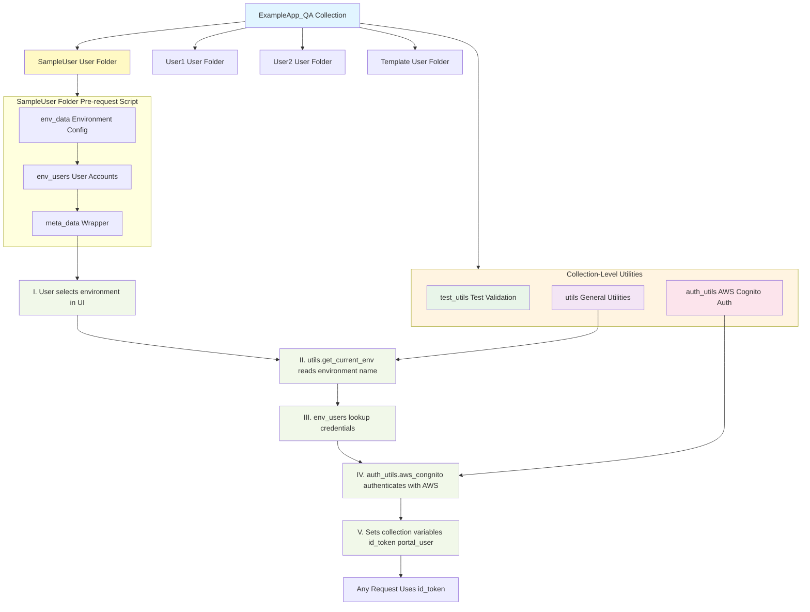

# Postman Utilities Architecture Documentation

## Table of Contents

1. [Overview](#overview)
2. [Quick Reference](#quick-reference)
3. [Architecture Overview](#architecture-overview)
4. [Environment Selection Mechanism](#environment-selection-mechanism)
5. [Complete Authentication Flow](#complete-authentication-flow)
6. [Real Code Examples](#real-code-examples)
7. [Usage Statistics](#usage-statistics)
8. [Utility Function Reference](#utility-function-reference)
9. [Best Practices](#best-practices)
10. [Troubleshooting](#troubleshooting)
11. [Migration Guide](#migration-guide)
12. [Glossary](#glossary)

---

## Overview

This document explains the three-tier utility architecture used in the ExampleApp_QA Postman collection, which enables utility reusability and flexibility for team members to define their own test accounts and test scripts.

---

## Quick Reference

### Common Patterns

#### Authenticate with AWS Cognito
```javascript
auth_utils.aws_congnito(pm, console, {
    env_users: meta_data.env_users(),
    test_user_type: 00, // 00=admin, 01=regular, 99=automation
    tmp_token: tmp_token, // Only for demo/prod
});
```

#### Validate Response Code
```javascript
test_utils.validate_resp_code(pm, 200);
```

#### Get Current Environment
```javascript
const env = utils.get_current_env(pm); // Returns: "qa", "dev", "demo", "prod"
```

#### Generate Test Data
```javascript
const timestamp = utils.get_iso8601_timestamp();
const emails = utils.get_random_emails({ count: 5 });
```

### Function Quick Lookup

| Need | Use This |
|------|----------|
| Authenticate user | `auth_utils.aws_congnito()` |
| Validate HTTP status | `test_utils.validate_resp_code()` |
| Get environment name | `utils.get_current_env()` |
| Generate timestamp | `utils.get_iso8601_timestamp()` |
| Generate random emails | `utils.get_random_emails()` |
| Check if token expired | Run "Get ID Token" again |

---

## Architecture Overview

The collection uses a **three-tier architecture** for utility reusability:

### Tier 1: Collection-Level Utilities

**Location:** Collection Pre-request Script (defined once, available to all folders)

Three main utility objects provide reusable functionality:

1. **`test_utils`** - Test validation and assertion helpers
2. **`auth_utils`** - AWS Cognito authentication utilities  
3. **`utils`** - General utility functions (timestamps, random values, environment detection, etc.)

### Tier 2: User Folder-Level Configuration

**Location:** Folder Pre-request Script (each user folder defines their own)

Each user folder (e.g., "SampleUser") defines environment-specific configuration:

- **`env_data`** - Environment configuration (region, client_id, password) per environment (dev, qa, demo, prod)
- **`env_users`** - User accounts organized by environment and `test_user_type`:
  - `00` - Admin test user
  - `01` - Regular test user  
  - `99` - Automation account
  - Custom types as needed
- **`meta_data`** - Wrapper object providing `env_users()` function to access folder's user definitions

### Tier 3: Request-Level Usage

**Location:** Individual request scripts (pre-request and test scripts)

Requests use the utilities defined at collection and folder levels to:
- Authenticate and obtain tokens
- Generate test data
- Validate responses
- Perform common operations

---

## Environment Selection Mechanism

The architecture leverages Postman's environment system for environment-specific configuration:

1. **User selects environment** via Postman UI dropdown (e.g., "QA Environment", "Prod Environment")
2. **Script detects environment** using `utils.get_current_env(pm)` which reads `pm.environment['name']`
3. **Lookup occurs** via `env_users[env][test_user_type]` to get:
   - User email address
   - Password
   - AWS Region
   - Cognito Client ID

This allows the same script to work across all environments without modification.

---

## Architecture Diagram



---

## Complete Authentication Flow

The authentication process follows these steps:

### Step 1: Environment Selection
User selects an environment from the Postman UI dropdown (e.g., "QA Environment", "Prod Environment").

### Step 2: Folder Configuration Setup
Each user folder defines its configuration in the folder's pre-request script.

### Step 3: Run Get ID Token Request
User executes the "Setup/Get ID Token" request in their folder, which calls `auth_utils.aws_congnito()`.

### Step 4: Environment Detection
`auth_utils.aws_congnito()` uses `utils.get_current_env(pm)` to detect the selected environment.

### Step 5: Credential Lookup
The function looks up credentials from `env_users[env][test_user_type]` based on:
- Selected environment (from UI)
- Test user type (specified in the request script)

### Step 6: AWS Cognito Authentication
Authenticates with AWS Cognito using the retrieved credentials.

### Step 7: Token Storage
Sets collection variables for reuse:
- `id_token` - JWT token for API authentication
- `portal_user` - Authenticated user email

### Step 8: Request Reuse
All subsequent requests in the collection can use `{{id_token}}` in their authorization headers.

---

## Real Code Examples

> **Note:** The code examples below contain partially masked sensitive data (user accounts, client IDs, and API endpoints) for security purposes. In your actual implementation, use real values from your environment configuration.

### Example 1: SampleUser Folder-Level Configuration

**Location:** SampleUser folder pre-request script

```javascript
// Get password from Postman globals
const password = pm.globals.get('secret_sampleuser');

// Define environment-specific configuration
// Note: Client IDs are partially masked (showing last portion only) for sensitive data protection
const env_data = {
    dev: {
        region: 'us-east-1',
        client_id: '******q8a39e6q0b4g5hqjehm', // Partially masked for sensitive data protection
        password: password,
    },
    qa: {
        region: 'us-east-1',
        client_id: '******sj1ua5vp4d7iufgjtrt0q', // Partially masked for sensitive data protection
        password: password,
    },
    demo: {
        region: 'us-west-2',
        client_id: '******8ke3lrjeq5pqic9u4ufs0', // Partially masked for sensitive data protection
        password: password,
    },
    prod: {
        region: 'us-west-2',
        client_id: '******pvape00hhqslh0gh3teseek', // Partially masked for sensitive data protection
        password: password,
    }
};

// Define user accounts per environment and test_user_type
// Note: User accounts are partially masked (showing structure while hiding sensitive parts) for sensitive data protection
const env_users = {
    "qa": {
        00: {
            user: 'user+***test-admin01@gmail.com', // Partially masked for sensitive data protection
            pwd: env_data.qa.password,
            region: env_data.qa.region,
            clientId: env_data.qa.client_id
        },
        01: {
            user: 'user+qa-***01@gmail.com', // Partially masked for sensitive data protection
            pwd: env_data.qa.password,
            region: env_data.qa.region,
            clientId: env_data.qa.client_id
        },
        99: {
            user: '***+automation@gmail.com', // Partially masked for sensitive data protection
            pwd: pm.globals.get('secret_auto'),
            region: env_data.qa.region,
            clientId: env_data.qa.client_id
        },
    },
    "demo": {
        00: {
            user: 'user+***-admin01@gmail.com', // Partially masked for sensitive data protection
            pwd: env_data.demo.password,
            region: env_data.demo.region,
            clientId: env_data.demo.client_id
        },
        01: {
            user: 'user+***-pentest-01@gmail.com', // Partially masked for sensitive data protection
            pwd: env_data.demo.password,
            region: env_data.demo.region,
            clientId: env_data.demo.client_id
        },
        99: {
            user: '***+automation@gmail.com', // Partially masked for sensitive data protection
            pwd: pm.globals.get('secret_auto'),
            region: env_data.demo.region,
            clientId: env_data.demo.client_id
        },
    },
    "prod": {
        00: {
            user: 'user+***-admin01@gmail.com', // Partially masked for sensitive data protection
            pwd: env_data.prod.password,
            region: env_data.prod.region,
            clientId: env_data.prod.client_id
        },
        01: {
            user: 'user+***-mtk01@gmail.com', // Partially masked for sensitive data protection
            pwd: env_data.prod.password,
            region: env_data.prod.region,
            clientId: env_data.prod.client_id
        },
        99: {
            user: '***+prod@gmail.com', // Partially masked for sensitive data protection
            pwd: '*******', // Fully masked for sensitive data protection
            region: env_data.prod.region,
            clientId: env_data.prod.client_id
        },
    }
};

// Wrapper object to provide env_users to auth_utils
meta_data = {
    env_users: () => env_users
}
```

### Example 2: Setup/Get ID Token Request

**Location:** SampleUser/Setup/Get ID Token pre-request script

```javascript
// For demo/prod environments, you can paste a temporary token from web console
const tmp_token = '"authorization": "Bearer ..."';

auth_utils.aws_congnito(pm, console, {
    env_users: meta_data.env_users(),
    test_user_type: 99, // 00=admin, 01=regular, 99=automation
    tmp_token: tmp_token, // Only required for demo/prod environments
});
```

### Example 3: auth_utils.aws_congnito() Implementation

**Location:** Collection pre-request script

```javascript
auth_utils = {
    aws_congnito: (pm, console, cognito_options = {
        env_users,
        test_user_type,
        tmp_token
    }) => {
        const {
            env_users,
            test_user_type,
            tmp_token
        } = cognito_options;
        
        // Get current environment from Postman UI selection
        const env = utils.get_current_env(pm);
        
        // Look up user credentials based on environment and test_user_type
        // Note: Default clientId is partially masked for sensitive data protection
        const {user, pwd, region = 'us-east-1', clientId = '******sj1ua5vp4d7iufgjtrt0q'} = 
            env_users[env][test_user_type];
        
        // For prod/dev, use temporary token method
        if (env === 'prod' || env === 'dev') {
            auth_utils.parse_tmp_token(pm, tmp_token, user);
            return;
        }
        
        // Authenticate with AWS Cognito
        // Note: AWS endpoint URL structure is shown, but actual service endpoints are managed by AWS
        pm.sendRequest({
            url: `https://cognito-idp.${region}.amazonaws.com/`,
            method: 'POST',
            header: {
                'X-Amz-Target': 'AWSCognitoIdentityProviderService.InitiateAuth',
                'Content-Type': 'application/x-amz-json-1.1'
            },
            body: {
                mode: 'raw',
                raw: JSON.stringify({
                    "AuthParameters": {
                        "USERNAME": user,
                        "PASSWORD": pwd,
                    },
                    "AuthFlow": "USER_PASSWORD_AUTH",
                    "ClientId": clientId
                })
            }
        }, function(error, response) {
            const id_token = response.json().AuthenticationResult.IdToken;
            console.log(`logged-in user: ${user}, env: ${env}`);
            
            // Set collection variables for reuse by all requests
            pm.collectionVariables.set("id_token", `${id_token}`);
            pm.collectionVariables.set("portal_user", user);
        });
    }
}
```

### Example 4: Using id_token in Requests

**Location:** Any request in the collection

Requests use the `{{id_token}}` collection variable in their authorization:

```json
{
  "auth": {
    "type": "bearer",
    "bearer": [
      {
        "key": "token",
        "value": "{{id_token}}",
        "type": "string"
      }
    ]
  }
}
```

Or in headers:

```json
{
  "header": [
    {
      "key": "Authorization",
      "value": "{{id_token}}"
    }
  ]
}
```

---

## Usage Statistics

### Summary

| Utility | Total Usages | Unique Paths | Functions Available |
|---------|--------------|--------------|---------------------|
| `test_utils` | 231 | 231 | getAutomationTestDataLeftOver, post_action_getPolicy_forFilters, print_user_policies, validate_resp_code |
| `utils` | 15 | 15 | get_iso8601_timestamp, get_random_emails, get_unix_timestamp_with_ms, random_digits |
| `auth_utils` | 6 | 6 | aws_congnito |
| `meta_data` | Defined in 4 folders | 4 folders | `env_users()` |

### Detailed Usage by Folder

#### SampleUser (Example User Folder)

| Utility | Usage Count | Functions Used | Locations |
|---------|-------------|-----------------|-----------|
| `auth_utils` | 2 | aws_congnito | Setup/Get ID Token, playground/URLsBlockedAccessLogsLoop/[PmScripts]CreateLogs |
| `utils` | 10 | get_iso8601_timestamp, get_random_emails, get_unix_timestamp_with_ms, random_digits | AC-5717_PolicyV2 support Disable on/UpdatePolicyDisableAt/[UpdatePolicy]diablePolicy_UnixTimestamp, AC-5717_PolicyV2 support Disable on/CreatePolicyPolicyDisableAt/createPolicyV2_null, AC-5717_PolicyV2 support Disable on/CreatePolicyPolicyDisableAt/createPolicyV2_UnixTimestamp ... (10 total) |
| `test_utils` | 136 | validate_resp_code, post_action_getPolicy_forFilters, print_user_policies, getAutomationTestDataLeftOver | MTK_GetUserEntryInfo/GetUserEntry, MTK_GetUserEntryInfo/ListPolicyV2, MTK_GetUserEntryInfo/GetPolicyV2 ... (136 total) |
| `meta_data` | 2 | env_users | Setup/Get ID Token, playground/URLsBlockedAccessLogsLoop/[PmScripts]CreateLogs |
| `meta_data`` | Defined | `env_users()` | Folder Pre-request Script |

---

## Utility Function Reference

### test_utils Functions

#### `validate_resp_code(pm, expected_code)`
Validates HTTP response status code matches the expected value.

**Parameters:**
- `pm` (PostmanObject) - Postman instance
- `expected_code` (Number) - Expected HTTP status code (e.g., 200, 404)

**Example:**
```javascript
test_utils.validate_resp_code(pm, 200);
```

#### `print_user_policies(pm)`
Prints user policies from response for debugging.

**Parameters:**
- `pm` (PostmanObject) - Postman instance

**Example:**
```javascript
test_utils.print_user_policies(pm);
```

#### `post_action_getPolicy_forFilters(pm)`
Extracts policy filters for GraphQL queries from response.

**Parameters:**
- `pm` (PostmanObject) - Postman instance

**Returns:** Policy filters object

**Example:**
```javascript
const filters = test_utils.post_action_getPolicy_forFilters(pm);
```

#### `getAutomationTestDataLeftOver(options)`
Gets leftover test data for automation scenarios.

**Parameters:**
- `options` (Object) - Configuration options

**Returns:** Test data object

**Example:**
```javascript
const data = test_utils.getAutomationTestDataLeftOver({ type: 'policy' });
```

#### `malwareDetectedLogPayload()`
Generates malware detection log payload.

**Returns:** Payload object for malware detection logs

**Example:**
```javascript
const payload = test_utils.malwareDetectedLogPayload();
```

#### `urlBlockedLogPayloadTest()`
Generates URL blocked log payload.

**Returns:** Payload object for URL blocked logs

**Example:**
```javascript
const payload = test_utils.urlBlockedLogPayloadTest();
```

#### `createAccessLogsForMalwareDetectedLog(options)`
Creates access logs for malware detection.

**Parameters:**
- `options` (Object) - Configuration options

**Example:**
```javascript
test_utils.createAccessLogsForMalwareDetectedLog({ count: 5 });
```

#### `createAccessLogsForUrlBlockedLog(options)`
Creates access logs for URL blocks.

**Parameters:**
- `options` (Object) - Configuration options

**Example:**
```javascript
test_utils.createAccessLogsForUrlBlockedLog({ count: 5 });
```

---

### auth_utils Functions

#### `aws_congnito(pm, console, options)`
Authenticates with AWS Cognito and sets `id_token` and `portal_user` collection variables.

**Parameters:**
- `pm` (PostmanObject) - Postman instance (always pass `pm`)
- `console` (Console) - Console object (always pass `console`)
- `options` (Object) - Configuration object:
  - `env_users` (Function) - User accounts from `meta_data.env_users()`
  - `test_user_type` (Number) - User type: `00` (admin), `01` (regular), `99` (automation)
  - `tmp_token` (String, optional) - Temporary token for prod/demo environments

**Returns:** `undefined` (sets collection variables instead)

**Sets Collection Variables:**
- `id_token` - JWT token for API authentication
- `portal_user` - Authenticated user email

**Example:**
```javascript
auth_utils.aws_congnito(pm, console, {
    env_users: meta_data.env_users(),
    test_user_type: 99,
});
// Now {{id_token}} is available in all requests
```

**Notes:**
- Token is valid until it expires (typically 1 hour)
- For prod/demo, use `tmp_token` instead of authenticating directly
- Run this in "Setup/Get ID Token" request before other requests

#### `parse_tmp_token(pm, token_from_web, user)`
Parses temporary token from web console (for prod/demo environments).

**Parameters:**
- `pm` (PostmanObject) - Postman instance
- `token_from_web` (String) - Token string from web console
- `user` (String) - User email address

**Sets Collection Variables:**
- `id_token` - Parsed JWT token
- `portal_user` - User email

**Example:**
```javascript
auth_utils.parse_tmp_token(pm, '"authorization": "Bearer eyJ..."', 'user@example.com');
```

---

### utils Functions

#### `get_current_env(pm)`
Gets current environment name from Postman UI selection.

**Parameters:**
- `pm` (PostmanObject) - Postman instance

**Returns:** Environment name string (`"qa"`, `"dev"`, `"demo"`, or `"prod"`)

**Example:**
```javascript
const env = utils.get_current_env(pm);
console.log('Current environment:', env); // Output: "qa"
```

#### `get_current_env_simple_name(pm)`
Gets simplified environment name.

**Parameters:**
- `pm` (PostmanObject) - Postman instance

**Returns:** Simplified environment name string

**Example:**
```javascript
const simpleName = utils.get_current_env_simple_name(pm);
```

#### `random_digits(console, len)`
Generates random digits string.

**Parameters:**
- `console` (Console) - Console object
- `len` (Number) - Length of random digit string

**Returns:** Random digit string

**Example:**
```javascript
const digits = utils.random_digits(console, 10); // Returns: "1234567890"
```

#### `get_expect_variable_name(variable_name)`
Formats expect variable name.

**Parameters:**
- `variable_name` (String) - Variable name to format

**Returns:** Formatted variable name

**Example:**
```javascript
const formatted = utils.get_expect_variable_name('myVar');
```

#### `get_iso8601_timestamp()`
Gets ISO8601 formatted timestamp.

**Returns:** ISO8601 timestamp string (e.g., `"2024-01-15T10:30:00Z"`)

**Example:**
```javascript
const timestamp = utils.get_iso8601_timestamp();
```

#### `get_unix_timestamp_with_ms(options)`
Gets Unix timestamp with optional offset.

**Parameters:**
- `options` (Object, optional) - Configuration:
  - `offset` (Number) - Offset in milliseconds

**Returns:** Unix timestamp in milliseconds

**Example:**
```javascript
const timestamp = utils.get_unix_timestamp_with_ms({ offset: 3600000 }); // Add 1 hour
```

#### `get_random_emails(options)`
Generates random email addresses.

**Parameters:**
- `options` (Object) - Configuration:
  - `count` (Number) - Number of emails to generate

**Returns:** Array of email addresses

**Example:**
```javascript
const emails = utils.get_random_emails({ count: 5 });
// Returns: ["test1@example.com", "test2@example.com", ...]
```

#### `delay(milliseconds)`
Introduces a delay in script execution.

**Parameters:**
- `milliseconds` (Number) - Delay duration in milliseconds

**Example:**
```javascript
utils.delay(1000); // Wait 1 second
```

#### `isWithin30Mins(timestamp1, timestamp2)`
Checks if timestamps are within 30 minutes of each other.

**Parameters:**
- `timestamp1` (Number) - First timestamp
- `timestamp2` (Number) - Second timestamp

**Returns:** Boolean

**Example:**
```javascript
const isClose = utils.isWithin30Mins(timestamp1, timestamp2);
```

#### `get_uuid(pm)`
Generates UUID.

**Parameters:**
- `pm` (PostmanObject) - Postman instance

**Returns:** UUID string

**Example:**
```javascript
const uuid = utils.get_uuid(pm);
```

---

## Best Practices

### Adding a New User Folder

1. **Create a new folder** in the collection (e.g., "YourName")

2. **Add folder pre-request script** with:
   - `env_data` - Define region, client_id, and password for each environment
   - `env_users` - Define user accounts organized by environment and test_user_type
   - `meta_data` - Wrapper object with `env_users()` function

3. **Create Setup folder** with "Get ID Token" request that calls:
   ```javascript
   auth_utils.aws_congnito(pm, console, {
       env_users: meta_data.env_users(),
       test_user_type: 00, // or 01, 99, etc.
   });
   ```

4. **Use test_user_type conventions:**
   - `00` - Admin test user
   - `01` - Regular test user
   - `99` - Automation account
   - Custom types as needed

### Environment Configuration

- Use Postman globals to store sensitive passwords: `pm.globals.get('secret_yourname')`
- Define environment-specific values (region, client_id) in `env_data`
- Reference `env_data` values in `env_users` for consistency

### Token Reuse

- Once `id_token` is set via Setup/Get ID Token, all requests in the collection can use `{{id_token}}`
- The token is stored as a collection variable, so it's available across all folders and requests
- Refresh the token by running Setup/Get ID Token again when needed

---

## Troubleshooting

### Utility-Specific Issues

#### "auth_utils is not defined"
**Cause:** Collection pre-request script not loaded
**Solution:** Ensure you're running a request within the ExampleApp_QA collection

#### "meta_data is not defined"
**Cause:** Folder pre-request script missing or incorrect
**Solution:** 
1. Check that your user folder has a pre-request script
2. Verify it defines `meta_data = { env_users: () => env_users }`
3. See [Example 1](#example-1-sampleuser-folder-level-configuration) for reference

#### "env_users[env] is undefined"
**Cause:** Environment mismatch
**Solution:**
1. Check Postman environment selection
2. Verify `env_users` object includes the selected environment
3. Run `console.log(utils.get_current_env(pm))` to debug

#### "Invalid credentials" in AWS Cognito
**Cause:** Wrong credentials for environment
**Solution:**
1. Verify `env_users[env][test_user_type]` has correct credentials
2. Check that `client_id` matches the selected environment
3. For prod/demo, ensure `tmp_token` is provided

#### Connection errors to AWS Cognito
**Cause:** Network or endpoint issues
**Solution:**
1. Verify AWS region is correct for the environment
2. Check network connectivity
3. Ensure Cognito endpoint URL is accessible (AWS managed endpoints)
4. Verify client_id matches the region

### Debugging Tips

#### Enable Console Logging
```javascript
// In any pre-request or test script
console.log('Current env:', utils.get_current_env(pm));
console.log('Test user type:', test_user_type);
console.log('Available env_users:', Object.keys(env_users));
```

#### Check Collection Variables
```javascript
// View all collection variables
console.log('id_token:', pm.collectionVariables.get('id_token'));
console.log('portal_user:', pm.collectionVariables.get('portal_user'));
```

#### Test Environment Detection
```javascript
// Add to any pre-request script to debug
const env = utils.get_current_env(pm);
console.log('Detected environment:', env);
console.log('Environment name from UI:', pm.environment.name);
```

---

## Migration Guide

### Updating Your Folder Configuration

When utilities are updated at the collection level, you may need to update your folder configuration:

1. **Check for Breaking Changes**
   - Review collection pre-request script changes
   - Update function calls if signatures changed

2. **Update env_users Structure**
   - Ensure all required environments are defined
   - Add new test_user_type if needed
   - Update client_id if changed

3. **Test Your Configuration**
   - Run "Setup/Get ID Token" for each environment
   - Verify token is set correctly
   - Test a sample request

### Adding a New Environment

1. Add environment to `env_data`:
   ```javascript
   env_data: {
       // ... existing environments
       newenv: {
           region: 'us-east-1',
           client_id: 'your-client-id',
           password: password,
       }
   }
   ```

2. Add user accounts to `env_users`:
   ```javascript
   env_users: {
       // ... existing environments
       "newenv": {
           00: { /* admin user */ },
           01: { /* regular user */ },
           99: { /* automation */ }
       }
   }
   ```

3. Export and import the new environment file in Postman

---

## Glossary

- **Collection-Level Utilities** - Functions defined in collection pre-request script, available to all folders
- **Folder-Level Configuration** - Environment-specific setup in each user folder's pre-request script
- **env_users** - Object mapping environment → test_user_type → user credentials
- **test_user_type** - Numeric identifier for user type (00=admin, 01=regular, 99=automation)
- **meta_data** - Wrapper object that provides `env_users()` function to collection utilities
- **id_token** - JWT authentication token stored as collection variable
- **tmp_token** - Temporary token from web console, used for prod/demo environments
- **AWS Cognito** - AWS managed authentication service used for user authentication

---

## Notes

- **Collection-level utilities** are available to all folders and requests in the collection
- **Folder-level `meta_data`** provides environment-specific configuration and is used by `auth_utils.aws_congnito()`
- **Environment selection** happens via Postman UI dropdown, detected by `utils.get_current_env(pm)`
- **Token storage** uses collection variables, making `{{id_token}}` available to all requests
- The collection structure follows: Collection → Folders → Sub-folders → Requests
- Utilities are primarily used in pre-request scripts (for setup) and test scripts (for validation)
- **API endpoints** are masked in documentation for security - actual endpoints are configured in environment files
